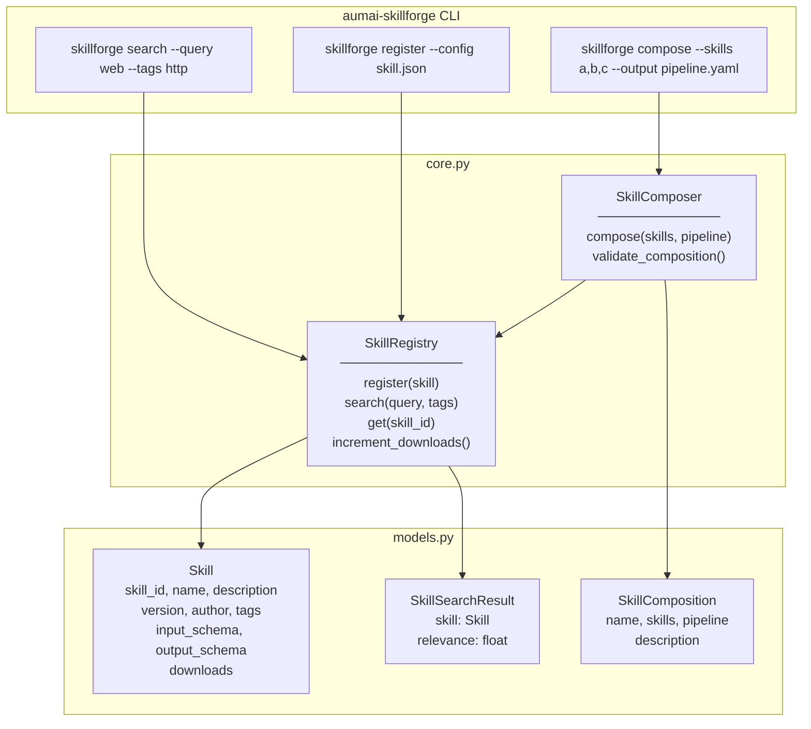

# aumai-skillforge

**Agent skill marketplace and composition.** Publish, discover, and compose reusable
agent skills into complex sequential workflows.

Part of the [AumAI](https://github.com/aumai) open-source agentic AI infrastructure suite.

[](https://github.com/aumai/aumai-skillforge/actions)
[](https://pypi.org/project/aumai-skillforge/)
[](LICENSE)
[](https://python.org)

---

## What is this?

Think of `aumai-skillforge` as an app store for agent capabilities. Just as a smartphone
gets its power from installable apps, an AI agent gets its intelligence from composable
skills. A skill is a discrete, reusable unit of capability: "search the web", "summarize
a document", "translate text", "query a database". SkillForge is the system that lets
you define, register, discover, and chain those skills together into pipelines.

### Why does this matter?

Most agent systems hard-code their tools inside the agent itself. This makes agents
monolithic, hard to share, and impossible to reuse. SkillForge inverts this: skills
are first-class objects with explicit input/output schemas, versioning, authorship, and
a download counter. This enables:

- **Discoverability**: Find skills by keyword or tag rather than reading source code.
- **Reuse**: Write a skill once, compose it into dozens of different pipelines.
- **Safety**: Validate that skill inputs and outputs are schema-compatible before
  running a pipeline — not after it crashes.
- **Ecosystems**: Build a catalogue of organizational skills the same way you manage
  a Python package registry.

---

## Architecture



---

## Features

- **In-memory skill registry** — `SkillRegistry` stores skills keyed by `skill_id`.
  Register, retrieve, and search without any external database.
- **TF-style relevance search** — `SkillRegistry.search()` scores skills by how many
  query terms appear in the name, description, author, and tags fields. Results are
  ranked by relevance and then by download count.
- **Tag filtering** — narrow search results to skills that carry all specified tags.
- **Download tracking** — `increment_downloads()` bumps a skill's counter, enabling
  popularity-based sorting.
- **Pipeline composition** — `SkillComposer.compose()` chains skills into a named
  `SkillComposition` that records the ordered skill IDs and step configuration.
- **Schema compatibility validation** — `SkillComposer.validate_composition()` checks
  that the `output_schema.properties` of each skill is a superset of the
  `input_schema.required` fields of the next skill in the pipeline.
- **YAML/JSON serialization** — compositions serialize to YAML or JSON via Pydantic's
  `.model_dump()`, ready for storage or hand-off to an orchestrator.

---

## Quick Start

### Installation

```bash
pip install aumai-skillforge
# With YAML support (recommended):
pip install "aumai-skillforge[yaml]"
```

### 1. Define a skill in JSON

```json
{
  "skill_id": "web-search-v1",
  "name": "Web Search",
  "description": "Search the web for a given query and return top results.",
  "version": "0.1.0",
  "author": "aumai-team",
  "tags": ["search", "http", "web"],
  "input_schema": {
    "type": "object",
    "properties": { "query": { "type": "string" } },
    "required": ["query"]
  },
  "output_schema": {
    "type": "object",
    "properties": {
      "results": { "type": "array" },
      "query": { "type": "string" }
    }
  },
  "downloads": 0
}
```

### 2. Register it

```bash
skillforge register --config web-search.json
# Registered skill 'Web Search' (ID: web-search-v1).
```

### 3. Search the registry

```bash
skillforge search --query "search web" --tags http
# [web-search-v1] Web Search v0.1.0  relevance=1.00  tags=search,http,web
```

### 4. Compose a pipeline

```bash
skillforge compose \
  --skills "web-search-v1,summarizer-v1" \
  --name "search-and-summarize" \
  --output pipeline.yaml
```

---

## CLI Reference

### `skillforge search`

Search for skills by keyword query and optional tag filter.

```
Usage: skillforge search [OPTIONS]

Options:
  --query TEXT  Search query string.              [default: ""]
  --tags TEXT   Comma-separated required tags.
  --help        Show this message and exit.
```

**Examples:**

```bash
# List all registered skills (empty query matches everything):
skillforge search

# Find skills about summarization tagged with "nlp":
skillforge search --query summarize --tags nlp

# Require multiple tags:
skillforge search --query database --tags sql,readonly
```

---

### `skillforge register`

Register a skill from a YAML or JSON definition file.

```
Usage: skillforge register [OPTIONS]

Options:
  --config PATH  Path to skill YAML/JSON config file.  [required]
  --help         Show this message and exit.
```

**Example:**

```bash
skillforge register --config ./skills/translate.yaml
```

---

### `skillforge compose`

Chain registered skills into a named pipeline and save it to a YAML file.
Also runs `validate_composition()` and prints any schema compatibility issues.

```
Usage: skillforge compose [OPTIONS]

Options:
  --skills TEXT   Comma-separated ordered skill IDs.        [required]
  --output PATH   Output YAML file for the pipeline.        [required]
  --name TEXT     Human-readable pipeline name.  [default: composition]
  --help          Show this message and exit.
```

**Example:**

```bash
skillforge compose \
  --skills "ingest-v1,clean-v1,summarize-v1,translate-v1" \
  --name "doc-processing-pipeline" \
  --output ./pipelines/doc-pipeline.yaml
```

---

### `skillforge serve`

Start the SkillForge API server (not yet implemented — reserved for future release).

---

## Python API Examples

### Registering and searching skills

```python
from aumai_skillforge.core import SkillRegistry
from aumai_skillforge.models import Skill

registry = SkillRegistry()

# Register a skill
registry.register(Skill(
    skill_id="summarizer-v1",
    name="Text Summarizer",
    description="Summarize a long document into a short paragraph.",
    author="aumai-team",
    tags=["nlp", "summarize", "text"],
    input_schema={
        "type": "object",
        "properties": {"text": {"type": "string"}},
        "required": ["text"],
    },
    output_schema={
        "type": "object",
        "properties": {
            "summary": {"type": "string"},
            "text": {"type": "string"},
        },
    },
))

# Search by keyword
results = registry.search(query="summarize text", tags=["nlp"])
for result in results:
    print(f"{result.skill.skill_id}: relevance={result.relevance:.2f}")
# summarizer-v1: relevance=1.00

# Retrieve by ID
skill = registry.get("summarizer-v1")
print(skill.name)  # Text Summarizer

# Track a download
registry.increment_downloads("summarizer-v1")
```

### Composing a pipeline

```python
from aumai_skillforge.core import SkillComposer, SkillRegistry
from aumai_skillforge.models import Skill

registry = SkillRegistry()
composer = SkillComposer(registry=registry)

# Register two compatible skills
registry.register(Skill(
    skill_id="fetcher-v1",
    name="URL Fetcher",
    description="Fetch content from a URL.",
    author="aumai-team",
    tags=["http"],
    input_schema={"type": "object", "properties": {"url": {"type": "string"}}, "required": ["url"]},
    output_schema={"type": "object", "properties": {"content": {"type": "string"}, "url": {"type": "string"}}},
))

registry.register(Skill(
    skill_id="summarizer-v1",
    name="Text Summarizer",
    description="Summarize a document.",
    author="aumai-team",
    tags=["nlp"],
    input_schema={"type": "object", "properties": {"content": {"type": "string"}}, "required": ["content"]},
    output_schema={"type": "object", "properties": {"summary": {"type": "string"}}},
))

# Compose and validate
composition = composer.compose(
    skills=["fetcher-v1", "summarizer-v1"],
    pipeline=[
        {"skill_id": "fetcher-v1", "step": 0},
        {"skill_id": "summarizer-v1", "step": 1},
    ],
    name="fetch-and-summarize",
    description="Fetch a URL, then summarize its content.",
)

issues = composer.validate_composition(composition)
if issues:
    for issue in issues:
        print(f"Issue: {issue}")
else:
    print("Pipeline is schema-compatible.")
# Pipeline is schema-compatible.
```

### Schema incompatibility detection

```python
# If fetcher-v1 output is missing a field that summarizer-v1 requires:
issues = composer.validate_composition(composition)
# ["Skill 'fetcher-v1' output is missing fields required by 'summarizer-v1': ['content']"]
```

---

## Skill Definition Reference

A `Skill` JSON/YAML file has the following fields:

```yaml
skill_id: string          # Required. Unique identifier, e.g. "web-search-v1".
name: string              # Required. Human-readable display name.
description: string       # Required. What the skill does.
version: "0.1.0"          # Optional. Semantic version. Default: "0.1.0".
author: string            # Required. Author name or organization.
tags: []                  # Optional. List of searchable tags.
downloads: 0              # Optional. Download counter. Default: 0. Min: 0.
input_schema: {}          # Optional. JSON Schema describing inputs.
output_schema: {}         # Optional. JSON Schema describing outputs.
```

### JSON Schema conventions for input_schema / output_schema

SkillComposer uses two specific keys during validation:

- `output_schema.properties` — dict of field names the skill produces.
- `input_schema.required` — list of field names the skill needs as input.

A composition is valid when every field in `required` of step N+1 exists as
a key in `properties` of step N.

---

## How It Works

### Search relevance algorithm

`SkillRegistry.search(query, tags)` works in three steps:

1. **Tag filter**: If `tags` is provided, only skills carrying all specified tags
   are considered.
2. **Term matching**: The query is tokenized into words. Each word is checked against
   the concatenation of `name + description + author + tags`. The relevance score
   is `hits / total_query_terms`, capped at 1.0.
3. **Sorting**: Results are sorted descending by `(relevance, downloads)`.

### Composition validation algorithm

`SkillComposer.validate_composition(composition)` iterates over consecutive skill
pairs in the pipeline. For each pair `(current, next)`:

- Extract `current.output_schema.properties` as the set of output field names.
- Extract `next.input_schema.required` as the set of required input field names.
- If the required set is not a subset of the output properties, record an issue.

This is intentionally structural, not semantic — it catches the most common
integration mistakes (missing fields) without requiring runtime execution.

---

## Integration with Other AumAI Projects

| Project | How it connects |
|---|---|
| **aumai-nanoagent** | Register skills as capabilities in a NanoAgent edge deployment. |
| **aumai-toolsmith** | Generate skill implementations from ToolSpec, then register them. |
| **aumai-specs** | Skill `input_schema` / `output_schema` follow JSON Schema conventions from aumai-specs. |
| **aumai-orchestrator** | Feed `SkillComposition` pipelines directly to an orchestration engine. |

---

## Contributing

```bash
git clone https://github.com/aumai/aumai-skillforge
cd aumai-skillforge
pip install -e ".[dev]"
make test
make lint
```

All pull requests must pass `ruff`, `mypy --strict`, and the full `pytest` suite.
Conventional commits are required: `feat:`, `fix:`, `refactor:`, `docs:`, `test:`, `chore:`.

---

## License

Apache License 2.0. See [LICENSE](LICENSE) for details.

```
Copyright 2024 AumAI Contributors

Licensed under the Apache License, Version 2.0 (the "License");
you may not use this file except in compliance with the License.
You may obtain a copy of the License at

    http://www.apache.org/licenses/LICENSE-2.0
```

---

## Part of AumAI

This project is part of [AumAI](https://github.com/aumai) — open-source infrastructure
for the agentic AI era.
